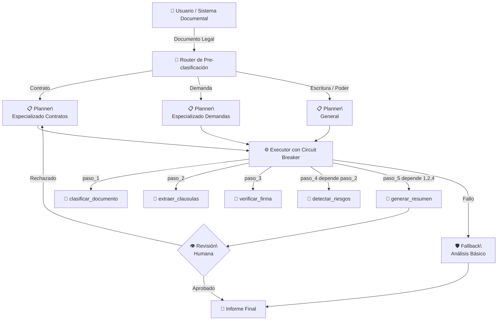

# Práctica 2 — Comparar Patrones y Proponer Arquitectura para un Caso Real

## Metadatos

| Campo            | Detalle                                      |
|------------------|----------------------------------------------|
| **Duración**     | 36 minutos                                   |
| **Complejidad**  | Media                                        |
| **Nivel Bloom**  | Aplicar                                      |
| **Lab anterior** | Lab 01-00-01 (componentes agénticos)         |
| **Costo API**    | $0.00 (no se requiere LLM real; stubs Python) |

---

## Descripción General

En este laboratorio implementarás prototipos mínimos de los tres patrones arquitectónicos agénticos —**ReAct**, **Planner-Executor** y **Router-Specialists**— aplicados a un escenario de **agente de análisis de documentos legales**. Utilizarás Python 3.11 con Pydantic 2.x para modelar los contratos de interfaces, stubs en lugar de LLMs reales para visualizar el flujo de control, y decoradores de reintento con backoff exponencial para el manejo de fallos. El entregable final es un **ADR (Architecture Decision Record)** que justifica la elección del patrón más adecuado para el caso asignado.

---

## Objetivos de Aprendizaje

- [ ] Implementar y comparar prototipos de los patrones ReAct, Planner-Executor y Router-Specialists con stubs Python y contratos Pydantic.
- [ ] Diseñar un esquema de orquestación con tool use y composición de habilidades para el análisis de documentos legales.
- [ ] Implementar estrategias de manejo de fallos: reintentos con backoff exponencial, circuit breaker simple y logging de degradación.
- [ ] Producir un ADR técnico con diagrama Mermaid, comparativa de patrones y justificación de la elección arquitectónica.

---

## Requisitos Previos

### Conocimientos
- Haber completado Lab 01-00-01 o comprender los componentes agénticos (razonamiento, planificación, acción, observación).
- Conocimiento de patrones de diseño de software (decorator, strategy, chain of responsibility).
- Experiencia con Python orientado a objetos y Pydantic 2.x para modelado de datos.

### Acceso y Herramientas
- Python 3.11.x instalado y disponible en el PATH.
- Acceso a Jupyter Lab (instalado en el entorno virtual).
- Editor de texto o IDE compatible con Markdown (VS Code recomendado para previsualizar diagramas Mermaid).
- **No se requiere API key de OpenAI** en este laboratorio (todos los LLMs son stubs).

---

## Entorno del Laboratorio

### Hardware Mínimo

| Recurso       | Mínimo requerido          |
|---------------|---------------------------|
| CPU           | 4 núcleos                 |
| RAM           | 8 GB (16 GB recomendado)  |
| Almacenamiento| 500 MB libres             |
| Red           | No requerida              |

### Software

| Componente       | Versión      | Uso en el lab                          |
|------------------|--------------|----------------------------------------|
| Python           | 3.11.x       | Implementación de prototipos           |
| Pydantic         | 2.8.x        | Contratos de interfaces                |
| Jupyter Lab      | 4.x          | Análisis comparativo interactivo       |
| rich             | 13.x         | Visualización de salidas en terminal   |
| tenacity         | 8.x          | Decoradores de reintento/backoff       |

### Configuración del Entorno

Ejecuta los siguientes comandos en tu terminal para crear un entorno aislado para este laboratorio:

```bash
# 1. Crear entorno virtual dedicado
python -m venv .venv-lab02

# 2. Activar el entorno
# En Linux/macOS:
source .venv-lab02/bin/activate
# En Windows (PowerShell):
.venv-lab02\Scripts\Activate.ps1

# 3. Instalar dependencias
pip install pydantic==2.8.* jupyterlab==4.* rich==13.* tenacity==8.*

# 4. Verificar instalación
python -c "import pydantic; import tenacity; import rich; print('OK')"

# 5. Crear directorio de trabajo
mkdir lab02_patrones && cd lab02_patrones

# 6. Iniciar Jupyter Lab
jupyter lab
```

> **Nota:** Si prefieres trabajar con scripts `.py` puros en lugar de notebooks, todos los pasos son igualmente válidos ejecutándolos desde la terminal.

---

## Pasos del Laboratorio

---

### Paso 1 — Modelar los Contratos de Interfaces con Pydantic

**Objetivo:** Definir los tipos de datos compartidos que usarán los tres patrones, garantizando consistencia en las interfaces entre componentes.

#### Instrucciones

1. En Jupyter Lab, crea un nuevo notebook llamado `lab02_patrones.ipynb`.

2. En la primera celda, escribe e importa las dependencias base:

```python
# Celda 1 — Imports y configuración base
from __future__ import annotations
from typing import Any, Dict, List, Optional, Literal
from enum import Enum
from datetime import datetime
import time
import random
import logging
from pydantic import BaseModel, Field, field_validator

# Configurar logging
logging.basicConfig(
    level=logging.INFO,
    format="%(asctime)s [%(levelname)s] %(name)s — %(message)s"
)
logger = logging.getLogger("lab02")

print("✅ Imports cargados correctamente")
```

3. En la segunda celda, define los modelos Pydantic que representan el dominio del problema: **análisis de documentos legales**.

```python
# Celda 2 — Contratos de interfaces (dominio: documentos legales)

class TipoDocumento(str, Enum):
    CONTRATO = "contrato"
    DEMANDA = "demanda"
    ESCRITURA = "escritura"
    PODER_NOTARIAL = "poder_notarial"
    DESCONOCIDO = "desconocido"

class DocumentoLegal(BaseModel):
    """Representa un documento legal a analizar."""
    id: str
    titulo: str
    contenido: str
    tipo: TipoDocumento = TipoDocumento.DESCONOCIDO
    fecha_ingreso: datetime = Field(default_factory=datetime.now)

    @field_validator("contenido")
    @classmethod
    def contenido_no_vacio(cls, v: str) -> str:
        if not v.strip():
            raise ValueError("El contenido del documento no puede estar vacío.")
        return v

class ResultadoAnalisis(BaseModel):
    """Resultado producido por cualquier patrón agéntico."""
    documento_id: str
    patron_usado: Literal["ReAct", "Planner-Executor", "Router-Specialists"]
    resumen: str
    clausulas_criticas: List[str] = Field(default_factory=list)
    riesgo_detectado: bool = False
    nivel_riesgo: Optional[Literal["bajo", "medio", "alto"]] = None
    pasos_ejecutados: int = 0
    latencia_ms: float = 0.0
    metadata: Dict[str, Any] = Field(default_factory=dict)

class PasoEjecucion(BaseModel):
    """Registro de un paso individual en la ejecución del agente."""
    numero: int
    tipo: Literal["pensamiento", "accion", "observacion", "plan", "ejecucion", "enrutamiento"]
    descripcion: str
    herramienta_usada: Optional[str] = None
    resultado: Optional[str] = None
    timestamp: datetime = Field(default_factory=datetime.now)

print("✅ Contratos Pydantic definidos:")
print(f"   - DocumentoLegal: {list(DocumentoLegal.model_fields.keys())}")
print(f"   - ResultadoAnalisis: {list(ResultadoAnalisis.model_fields.keys())}")
print(f"   - PasoEjecucion: {list(PasoEjecucion.model_fields.keys())}")
```

4. Ejecuta ambas celdas y verifica que no haya errores.

#### Salida Esperada

```
✅ Imports cargados correctamente
✅ Contratos Pydantic definidos:
   - DocumentoLegal: ['id', 'titulo', 'contenido', 'tipo', 'fecha_ingreso']
   - ResultadoAnalisis: ['documento_id', 'patron_usado', 'resumen', ...]
   - PasoEjecucion: ['numero', 'tipo', 'descripcion', ...]
```

#### Verificación

```python
# Celda de verificación — ejecutar después del Paso 1
doc_prueba = DocumentoLegal(
    id="DOC-001",
    titulo="Contrato de arrendamiento comercial",
    contenido="El arrendador cede el uso del inmueble ubicado en...",
    tipo=TipoDocumento.CONTRATO
)
print(f"✅ Documento creado: {doc_prueba.id} — {doc_prueba.titulo}")
assert doc_prueba.tipo == TipoDocumento.CONTRATO
print("✅ Validación Pydantic funciona correctamente")
```

---

### Paso 2 — Implementar las Herramientas (Stubs) del Dominio Legal

**Objetivo:** Crear stubs de herramientas que simulan las capacidades reales de un agente de análisis legal, sin depender de un LLM externo.

#### Instrucciones

1. En una nueva celda, implementa el registro de herramientas y sus stubs:

```python
# Celda 3 — Stubs de herramientas del dominio legal

class ToolRegistry:
    """Registro central de herramientas disponibles para los agentes."""
    
    def __init__(self):
        self._tools: Dict[str, callable] = {}
    
    def registrar(self, nombre: str):
        """Decorador para registrar una herramienta."""
        def decorator(func):
            self._tools[nombre] = func
            return func
        return decorator
    
    def ejecutar(self, nombre: str, **kwargs) -> str:
        if nombre not in self._tools:
            raise KeyError(f"Herramienta '{nombre}' no encontrada en el registro.")
        return self._tools[nombre](**kwargs)
    
    def listar(self) -> List[str]:
        return list(self._tools.keys())

# Instancia global del registro
registry = ToolRegistry()

@registry.registrar("clasificar_documento")
def clasificar_documento(contenido: str) -> str:
    """Stub: clasifica el tipo de documento legal."""
    time.sleep(0.05)  # Simular latencia de procesamiento
    keywords = {
        "arrendamiento": "contrato",
        "demanda": "demanda",
        "escritura": "escritura",
        "poder": "poder_notarial"
    }
    contenido_lower = contenido.lower()
    for kw, tipo in keywords.items():
        if kw in contenido_lower:
            return f"Tipo detectado: {tipo} (confianza: 0.92)"
    return "Tipo detectado: desconocido (confianza: 0.45)"

@registry.registrar("extraer_clausulas")
def extraer_clausulas(contenido: str) -> str:
    """Stub: extrae cláusulas relevantes del documento."""
    time.sleep(0.08)
    clausulas = [
        "Cláusula 3: Penalización por incumplimiento del 15% mensual",
        "Cláusula 7: Jurisdicción exclusiva en tribunales de la Ciudad de México",
        "Cláusula 12: Renovación automática sin previo aviso"
    ]
    return f"Cláusulas extraídas ({len(clausulas)}): " + " | ".join(clausulas)

@registry.registrar("detectar_riesgos")
def detectar_riesgos(clausulas: str) -> str:
    """Stub: analiza cláusulas para detectar riesgos legales."""
    time.sleep(0.1)
    riesgos = []
    if "penalización" in clausulas.lower():
        riesgos.append("RIESGO ALTO: Penalización excesiva detectada")
    if "automática" in clausulas.lower():
        riesgos.append("RIESGO MEDIO: Renovación automática sin notificación")
    if not riesgos:
        return "Sin riesgos significativos detectados."
    return " | ".join(riesgos)

@registry.registrar("generar_resumen")
def generar_resumen(tipo: str, clausulas: str, riesgos: str) -> str:
    """Stub: genera un resumen ejecutivo del análisis."""
    time.sleep(0.06)
    return (
        f"RESUMEN EJECUTIVO — Documento tipo '{tipo}'. "
        f"Se identificaron cláusulas críticas que requieren revisión. "
        f"Estado de riesgo: {'REQUIERE ATENCIÓN' if 'RIESGO' in riesgos else 'ACEPTABLE'}."
    )

@registry.registrar("verificar_firma")
def verificar_firma(contenido: str) -> str:
    """Stub: verifica la presencia de firmas y sellos."""
    time.sleep(0.04)
    tiene_firma = "firma" in contenido.lower() or "sello" in contenido.lower()
    return f"Firma: {'PRESENTE' if tiene_firma else 'AUSENTE'} | Sello notarial: {'PRESENTE' if 'notarial' in contenido.lower() else 'AUSENTE'}"

print(f"✅ Herramientas registradas: {registry.listar()}")
```

2. Ejecuta la celda y verifica el registro de herramientas.

#### Salida Esperada

```
✅ Herramientas registradas: ['clasificar_documento', 'extraer_clausulas', 
   'detectar_riesgos', 'generar_resumen', 'verificar_firma']
```

#### Verificación

```python
# Prueba rápida de las herramientas
resultado_test = registry.ejecutar("clasificar_documento", contenido="contrato de arrendamiento")
print(f"✅ Herramienta 'clasificar_documento': {resultado_test}")
assert "contrato" in resultado_test.lower()
```

---

### Paso 3 — Implementar el Prototipo del Patrón ReAct

**Objetivo:** Construir un prototipo funcional del patrón ReAct con un LLM stub que simula el ciclo Pensamiento → Acción → Observación.

#### Instrucciones

1. Implementa el stub del LLM y el agente ReAct completo:

```python
# Celda 4 — Prototipo del patrón ReAct

class LLMStub:
    """
    Simula el comportamiento de un LLM para el patrón ReAct.
    En producción, este componente sería reemplazado por una llamada real a OpenAI/Claude.
    """
    
    def __init__(self, nombre: str = "stub-gpt"):
        self.nombre = nombre
        self._paso_actual = 0
        # Script predefinido que simula el razonamiento del LLM
        self._script = [
            ("pensamiento", "Necesito primero clasificar el tipo de documento para entender su naturaleza.", 
             "clasificar_documento"),
            ("pensamiento", "Con el tipo identificado, debo extraer las cláusulas relevantes.",
             "extraer_clausulas"),
            ("pensamiento", "Ahora analizaré los riesgos presentes en las cláusulas extraídas.",
             "detectar_riesgos"),
            ("pensamiento", "Tengo suficiente información para verificar la firma y generar el resumen final.",
             "verificar_firma"),
            ("final", "He completado el análisis. Procedo a generar el resumen ejecutivo.",
             "generar_resumen"),
        ]
    
    def razonar(self, historial: str) -> tuple[str, str]:
        """Devuelve (pensamiento, herramienta_a_usar)."""
        if self._paso_actual >= len(self._script):
            return ("No hay más pasos que ejecutar.", "respuesta_final")
        
        _, pensamiento, herramienta = self._script[self._paso_actual]
        self._paso_actual += 1
        return pensamiento, herramienta
    
    def reset(self):
        self._paso_actual = 0


class AgenteReAct:
    """
    Implementación del patrón ReAct para análisis de documentos legales.
    Ciclo: Pensamiento → Acción → Observación (repetir hasta respuesta final)
    """
    
    def __init__(self, registry: ToolRegistry, max_pasos: int = 10):
        self.registry = registry
        self.max_pasos = max_pasos
        self.llm = LLMStub(nombre="react-stub")
        self.logger = logging.getLogger("lab02.react")
    
    def analizar(self, documento: DocumentoLegal) -> ResultadoAnalisis:
        inicio = time.time()
        self.llm.reset()
        
        historial: List[PasoEjecucion] = []
        observaciones: Dict[str, str] = {"contenido": documento.contenido}
        contador = 0
        resumen_final = ""
        
        self.logger.info(f"[ReAct] Iniciando análisis de '{documento.titulo}'")
        
        for i in range(self.max_pasos):
            contador += 1
            
            # FASE: PENSAMIENTO
            pensamiento, herramienta = self.llm.razonar(str(observaciones))
            
            paso_pensamiento = PasoEjecucion(
                numero=contador,
                tipo="pensamiento",
                descripcion=pensamiento,
                herramienta_usada=herramienta
            )
            historial.append(paso_pensamiento)
            self.logger.info(f"  💭 Paso {i+1} — Pensamiento: {pensamiento[:60]}...")
            
            # CONDICIÓN DE PARADA
            if herramienta == "respuesta_final":
                break
            
            # FASE: ACCIÓN
            try:
                if herramienta == "clasificar_documento":
                    resultado_obs = self.registry.ejecutar(herramienta, contenido=documento.contenido)
                elif herramienta == "extraer_clausulas":
                    resultado_obs = self.registry.ejecutar(herramienta, contenido=documento.contenido)
                elif herramienta == "detectar_riesgos":
                    clausulas = observaciones.get("clausulas", "sin cláusulas")
                    resultado_obs = self.registry.ejecutar(herramienta, clausulas=clausulas)
                elif herramienta == "verificar_firma":
                    resultado_obs = self.registry.ejecutar(herramienta, contenido=documento.contenido)
                elif herramienta == "generar_resumen":
                    resultado_obs = self.registry.ejecutar(
                        herramienta,
                        tipo=observaciones.get("tipo", "desconocido"),
                        clausulas=observaciones.get("clausulas", ""),
                        riesgos=observaciones.get("riesgos", "")
                    )
                    resumen_final = resultado_obs
                else:
                    resultado_obs = f"Herramienta '{herramienta}' no reconocida."
            except Exception as e:
                resultado_obs = f"ERROR en herramienta '{herramienta}': {str(e)}"
                self.logger.warning(f"  ⚠️ Error en acción: {e}")
            
            # FASE: OBSERVACIÓN
            observaciones[herramienta.replace("_", "_obs_")] = resultado_obs
            # Guardar observaciones clave para contexto
            if "tipo" in resultado_obs.lower() or "detectado" in resultado_obs.lower():
                observaciones["tipo"] = resultado_obs
            if "cláusula" in resultado_obs.lower():
                observaciones["clausulas"] = resultado_obs
            if "riesgo" in resultado_obs.lower():
                observaciones["riesgos"] = resultado_obs
            
            paso_obs = PasoEjecucion(
                numero=contador,
                tipo="observacion",
                descripcion=f"Observación de '{herramienta}'",
                herramienta_usada=herramienta,
                resultado=resultado_obs
            )
            historial.append(paso_obs)
            self.logger.info(f"  🔍 Observación: {resultado_obs[:80]}...")
        
        latencia = (time.time() - inicio) * 1000
        tiene_riesgo = any("RIESGO ALTO" in str(v) for v in observaciones.values())
        
        return ResultadoAnalisis(
            documento_id=documento.id,
            patron_usado="ReAct",
            resumen=resumen_final or "Análisis completado con información parcial.",
            clausulas_criticas=[
                c.strip() for c in observaciones.get("clausulas", "").split("|") 
                if "cláusula" in c.lower()
            ],
            riesgo_detectado=tiene_riesgo,
            nivel_riesgo="alto" if tiene_riesgo else "medio",
            pasos_ejecutados=len(historial),
            latencia_ms=round(latencia, 2),
            metadata={"historial_pasos": len(historial), "patron": "ReAct"}
        )


# --- Ejecutar el prototipo ReAct ---
documento_legal = DocumentoLegal(
    id="DOC-001",
    titulo="Contrato de arrendamiento comercial — Plaza Central",
    contenido=(
        "El arrendador cede el uso del inmueble ubicado en Av. Reforma 100. "
        "Cláusula de penalización por incumplimiento del 15% mensual. "
        "Renovación automática sin previo aviso. "
        "Requiere firma y sello notarial del arrendatario."
    ),
    tipo=TipoDocumento.CONTRATO
)

agente_react = AgenteReAct(registry=registry)
resultado_react = agente_react.analizar(documento_legal)

print("\n" + "="*60)
print("RESULTADO — Patrón ReAct")
print("="*60)
print(resultado_react.model_dump_json(indent=2))
```

#### Salida Esperada

```
INFO — [ReAct] Iniciando análisis de 'Contrato de arrendamiento comercial...'
INFO —   💭 Paso 1 — Pensamiento: Necesito primero clasificar el tipo de documento...
INFO —   🔍 Observación: Tipo detectado: contrato (confianza: 0.92)
...
RESULTADO — Patrón ReAct
============================================================
{
  "documento_id": "DOC-001",
  "patron_usado": "ReAct",
  "resumen": "RESUMEN EJECUTIVO — Documento tipo 'Tipo detectado: contrato...'",
  "riesgo_detectado": true,
  "nivel_riesgo": "alto",
  "pasos_ejecutados": 9,
  "latencia_ms": 330.0,
  ...
}
```

#### Verificación

```python
assert resultado_react.patron_usado == "ReAct"
assert resultado_react.pasos_ejecutados > 0
assert resultado_react.latencia_ms > 0
print(f"✅ ReAct ejecutó {resultado_react.pasos_ejecutados} pasos en {resultado_react.latencia_ms:.1f} ms")
```

---

### Paso 4 — Implementar el Prototipo del Patrón Planner-Executor

**Objetivo:** Construir un prototipo del patrón Planner-Executor que separa explícitamente la fase de planificación de la fase de ejecución, con soporte para dependencias entre pasos.

#### Instrucciones

1. Implementa el Planner, el Executor y el agente completo:

```python
# Celda 5 — Prototipo del patrón Planner-Executor

class PasoPlan(BaseModel):
    """Un paso individual dentro de un plan de ejecución."""
    id: str
    descripcion: str
    herramienta: str
    parametros_template: Dict[str, str] = Field(default_factory=dict)
    depende_de: List[str] = Field(default_factory=list)
    resultado: Optional[str] = None
    ejecutado: bool = False


class Plan(BaseModel):
    """Plan completo generado por el Planner."""
    objetivo: str
    pasos: List[PasoPlan]
    creado_en: datetime = Field(default_factory=datetime.now)
    
    def pasos_listos(self, resultados: Dict[str, str]) -> List[PasoPlan]:
        """Devuelve los pasos cuyas dependencias ya fueron satisfechas."""
        return [
            p for p in self.pasos 
            if not p.ejecutado and all(dep in resultados for dep in p.depende_de)
        ]


class PlannerStub:
    """
    Stub del componente Planner.
    En producción: llamada a LLM con prompt de descomposición de tareas.
    """
    
    def generar_plan(self, documento: DocumentoLegal) -> Plan:
        """Genera un plan estático para análisis de documentos legales."""
        pasos = [
            PasoPlan(
                id="paso_1",
                descripcion="Clasificar el tipo de documento legal",
                herramienta="clasificar_documento",
                parametros_template={"contenido": "{documento.contenido}"},
                depende_de=[]
            ),
            PasoPlan(
                id="paso_2",
                descripcion="Extraer cláusulas relevantes del documento",
                herramienta="extraer_clausulas",
                parametros_template={"contenido": "{documento.contenido}"},
                depende_de=[]  # Puede ejecutarse en paralelo con paso_1
            ),
            PasoPlan(
                id="paso_3",
                descripcion="Verificar presencia de firma y sello notarial",
                herramienta="verificar_firma",
                parametros_template={"contenido": "{documento.contenido}"},
                depende_de=[]  # Independiente
            ),
            PasoPlan(
                id="paso_4",
                descripcion="Detectar riesgos legales en las cláusulas extraídas",
                herramienta="detectar_riesgos",
                parametros_template={"clausulas": "{paso_2}"},
                depende_de=["paso_2"]  # Requiere resultado de paso_2
            ),
            PasoPlan(
                id="paso_5",
                descripcion="Generar resumen ejecutivo del análisis completo",
                herramienta="generar_resumen",
                parametros_template={
                    "tipo": "{paso_1}",
                    "clausulas": "{paso_2}",
                    "riesgos": "{paso_4}"
                },
                depende_de=["paso_1", "paso_2", "paso_4"]  # Requiere todo lo anterior
            ),
        ]
        return Plan(
            objetivo=f"Análisis legal completo de: {documento.titulo}",
            pasos=pasos
        )


class Executor:
    """
    Componente Executor: procesa cada paso del plan respetando dependencias.
    """
    
    def __init__(self, registry: ToolRegistry):
        self.registry = registry
        self.logger = logging.getLogger("lab02.executor")
    
    def ejecutar_plan(self, plan: Plan, documento: DocumentoLegal) -> Dict[str, str]:
        resultados: Dict[str, str] = {}
        historial_ejecucion: List[PasoEjecucion] = []
        numero_paso = 0
        
        self.logger.info(f"[Executor] Iniciando ejecución del plan: '{plan.objetivo}'")
        self.logger.info(f"[Executor] Total de pasos en el plan: {len(plan.pasos)}")
        
        # Ejecutar en orden topológico (simplificado: iteración hasta completar)
        max_iteraciones = len(plan.pasos) * 2
        iteracion = 0
        
        while len(resultados) < len(plan.pasos) and iteracion < max_iteraciones:
            iteracion += 1
            pasos_listos = plan.pasos_listos(resultados)
            
            if not pasos_listos:
                self.logger.warning("[Executor] No hay pasos listos para ejecutar. Posible dependencia circular.")
                break
            
            for paso in pasos_listos:
                numero_paso += 1
                self.logger.info(f"  ▶️  Ejecutando paso {paso.id}: {paso.descripcion}")
                
                # Resolver parámetros usando resultados previos
                params = {}
                if paso.herramienta == "clasificar_documento":
                    params = {"contenido": documento.contenido}
                elif paso.herramienta == "extraer_clausulas":
                    params = {"contenido": documento.contenido}
                elif paso.herramienta == "verificar_firma":
                    params = {"contenido": documento.contenido}
                elif paso.herramienta == "detectar_riesgos":
                    params = {"clausulas": resultados.get("paso_2", "")}
                elif paso.herramienta == "generar_resumen":
                    params = {
                        "tipo": resultados.get("paso_1", "desconocido"),
                        "clausulas": resultados.get("paso_2", ""),
                        "riesgos": resultados.get("paso_4", "")
                    }
                
                resultado = self.registry.ejecutar(paso.herramienta, **params)
                resultados[paso.id] = resultado
                paso.resultado = resultado
                paso.ejecutado = True
                
                historial_ejecucion.append(PasoEjecucion(
                    numero=numero_paso,
                    tipo="ejecucion",
                    descripcion=paso.descripcion,
                    herramienta_usada=paso.herramienta,
                    resultado=resultado
                ))
                self.logger.info(f"  ✅ Resultado de {paso.id}: {resultado[:70]}...")
        
        return resultados


class AgentePlannerExecutor:
    """
    Implementación del patrón Planner-Executor para análisis de documentos legales.
    """
    
    def __init__(self, registry: ToolRegistry):
        self.planner = PlannerStub()
        self.executor = Executor(registry)
        self.logger = logging.getLogger("lab02.planner_executor")
    
    def analizar(self, documento: DocumentoLegal) -> ResultadoAnalisis:
        inicio = time.time()
        
        # FASE 1: PLANIFICACIÓN
        self.logger.info(f"[Planner-Executor] FASE 1 — Planificación para '{documento.titulo}'")
        plan = self.planner.generar_plan(documento)
        self.logger.info(f"  📋 Plan generado con {len(plan.pasos)} pasos")
        
        # FASE 2: EJECUCIÓN
        self.logger.info("[Planner-Executor] FASE 2 — Ejecución del plan")
        resultados = self.executor.ejecutar_plan(plan, documento)
        
        latencia = (time.time() - inicio) * 1000
        resumen = resultados.get("paso_5", "Sin resumen disponible.")
        riesgos_raw = resultados.get("paso_4", "")
        tiene_riesgo = "RIESGO ALTO" in riesgos_raw
        
        return ResultadoAnalisis(
            documento_id=documento.id,
            patron_usado="Planner-Executor",
            resumen=resumen,
            clausulas_criticas=[
                c.strip() for c in resultados.get("paso_2", "").split("|")
                if "cláusula" in c.lower()
            ],
            riesgo_detectado=tiene_riesgo,
            nivel_riesgo="alto" if tiene_riesgo else "bajo",
            pasos_ejecutados=len(resultados),
            latencia_ms=round(latencia, 2),
            metadata={"plan_objetivo": plan.objetivo, "pasos_en_plan": len(plan.pasos)}
        )


# --- Ejecutar el prototipo Planner-Executor ---
agente_pe = AgentePlannerExecutor(registry=registry)
resultado_pe = agente_pe.analizar(documento_legal)

print("\n" + "="*60)
print("RESULTADO — Patrón Planner-Executor")
print("="*60)
print(resultado_pe.model_dump_json(indent=2))
```

#### Salida Esperada

```
INFO — [Planner-Executor] FASE 1 — Planificación para 'Contrato de arrendamiento...'
INFO —   📋 Plan generado con 5 pasos
INFO — [Planner-Executor] FASE 2 — Ejecución del plan
INFO —   ▶️  Ejecutando paso paso_1: Clasificar el tipo de documento legal
INFO —   ✅ Resultado de paso_1: Tipo detectado: contrato (confianza: 0.92)
...
{
  "patron_usado": "Planner-Executor",
  "pasos_ejecutados": 5,
  ...
}
```

#### Verificación

```python
assert resultado_pe.patron_usado == "Planner-Executor"
assert resultado_pe.pasos_ejecutados == 5
print(f"✅ Planner-Executor ejecutó {resultado_pe.pasos_ejecutados} pasos en {resultado_pe.latencia_ms:.1f} ms")
```

---

### Paso 5 — Implementar el Prototipo del Patrón Router-Specialists

**Objetivo:** Construir un prototipo del patrón Router-Specialists donde un componente central enruta el documento al especialista más adecuado según su tipo.

#### Instrucciones

1. Implementa los especialistas y el router:

```python
# Celda 6 — Prototipo del patrón Router-Specialists

class EspecialistaBase:
    """Clase base para todos los agentes especialistas."""
    
    def __init__(self, nombre: str, registry: ToolRegistry):
        self.nombre = nombre
        self.registry = registry
        self.logger = logging.getLogger(f"lab02.especialista.{nombre}")
    
    def puede_manejar(self, documento: DocumentoLegal) -> bool:
        raise NotImplementedError
    
    def analizar(self, documento: DocumentoLegal) -> Dict[str, str]:
        raise NotImplementedError


class EspecialistaContratos(EspecialistaBase):
    """Especialista en contratos comerciales y civiles."""
    
    def __init__(self, registry: ToolRegistry):
        super().__init__("contratos", registry)
        self.tipos_soportados = [TipoDocumento.CONTRATO]
    
    def puede_manejar(self, documento: DocumentoLegal) -> bool:
        return documento.tipo in self.tipos_soportados
    
    def analizar(self, documento: DocumentoLegal) -> Dict[str, str]:
        self.logger.info(f"[Especialista Contratos] Analizando: {documento.titulo}")
        clausulas = self.registry.ejecutar("extraer_clausulas", contenido=documento.contenido)
        riesgos = self.registry.ejecutar("detectar_riesgos", clausulas=clausulas)
        firma = self.registry.ejecutar("verificar_firma", contenido=documento.contenido)
        resumen = self.registry.ejecutar(
            "generar_resumen", tipo="contrato", clausulas=clausulas, riesgos=riesgos
        )
        return {"clausulas": clausulas, "riesgos": riesgos, "firma": firma, "resumen": resumen}


class EspecialistaDemandas(EspecialistaBase):
    """Especialista en demandas y litigios."""
    
    def __init__(self, registry: ToolRegistry):
        super().__init__("demandas", registry)
        self.tipos_soportados = [TipoDocumento.DEMANDA]
    
    def puede_manejar(self, documento: DocumentoLegal) -> bool:
        return documento.tipo in self.tipos_soportados
    
    def analizar(self, documento: DocumentoLegal) -> Dict[str, str]:
        self.logger.info(f"[Especialista Demandas] Analizando: {documento.titulo}")
        clausulas = self.registry.ejecutar("extraer_clausulas", contenido=documento.contenido)
        riesgos = self.registry.ejecutar("detectar_riesgos", clausulas=clausulas)
        resumen = self.registry.ejecutar(
            "generar_resumen", tipo="demanda", clausulas=clausulas, riesgos=riesgos
        )
        return {"clausulas": clausulas, "riesgos": riesgos, "resumen": resumen}


class EspecialistaGeneral(EspecialistaBase):
    """Especialista de fallback para documentos no clasificados."""
    
    def __init__(self, registry: ToolRegistry):
        super().__init__("general", registry)
    
    def puede_manejar(self, documento: DocumentoLegal) -> bool:
        return True  # Siempre puede manejar como fallback
    
    def analizar(self, documento: DocumentoLegal) -> Dict[str, str]:
        self.logger.info(f"[Especialista General] Analizando (fallback): {documento.titulo}")
        tipo_detectado = self.registry.ejecutar("clasificar_documento", contenido=documento.contenido)
        resumen = self.registry.ejecutar(
            "generar_resumen", tipo=tipo_detectado, clausulas="N/A", riesgos="Análisis básico"
        )
        return {"tipo_detectado": tipo_detectado, "resumen": resumen}


class RouterLegal:
    """
    Router central que enruta documentos al especialista correcto.
    Implementa un router híbrido: reglas primero, fallback a clasificación.
    """
    
    def __init__(self, especialistas: List[EspecialistaBase]):
        self.especialistas = especialistas
        self.logger = logging.getLogger("lab02.router")
    
    def enrutar(self, documento: DocumentoLegal) -> EspecialistaBase:
        self.logger.info(f"[Router] Evaluando documento tipo '{documento.tipo.value}'")
        
        # Estrategia: buscar el primer especialista no-fallback que pueda manejarlo
        for especialista in self.especialistas:
            if especialista.nombre != "general" and especialista.puede_manejar(documento):
                self.logger.info(f"  ✅ Enrutado a especialista: '{especialista.nombre}'")
                return especialista
        
        # Fallback al especialista general
        fallback = next(e for e in self.especialistas if e.nombre == "general")
        self.logger.info(f"  ⚠️ Usando fallback: '{fallback.nombre}'")
        return fallback


class AgenteRouterSpecialists:
    """
    Implementación del patrón Router-Specialists para análisis de documentos legales.
    """
    
    def __init__(self, registry: ToolRegistry):
        especialistas = [
            EspecialistaContratos(registry),
            EspecialistaDemandas(registry),
            EspecialistaGeneral(registry),
        ]
        self.router = RouterLegal(especialistas)
        self.logger = logging.getLogger("lab02.router_specialists")
    
    def analizar(self, documento: DocumentoLegal) -> ResultadoAnalisis:
        inicio = time.time()
        
        # FASE: ENRUTAMIENTO
        self.logger.info(f"[Router-Specialists] FASE 1 — Enrutamiento para '{documento.titulo}'")
        especialista = self.router.enrutar(documento)
        
        # FASE: ESPECIALIZACIÓN
        self.logger.info(f"[Router-Specialists] FASE 2 — Análisis por '{especialista.nombre}'")
        resultados = especialista.analizar(documento)
        
        latencia = (time.time() - inicio) * 1000
        riesgos_raw = resultados.get("riesgos", "")
        tiene_riesgo = "RIESGO ALTO" in riesgos_raw
        
        return ResultadoAnalisis(
            documento_id=documento.id,
            patron_usado="Router-Specialists",
            resumen=resultados.get("resumen", "Sin resumen."),
            clausulas_criticas=[
                c.strip() for c in resultados.get("clausulas", "").split("|")
                if "cláusula" in c.lower()
            ],
            riesgo_detectado=tiene_riesgo,
            nivel_riesgo="alto" if tiene_riesgo else "bajo",
            pasos_ejecutados=len(resultados),
            latencia_ms=round(latencia, 2),
            metadata={"especialista_usado": especialista.nombre}
        )


# --- Ejecutar el prototipo Router-Specialists ---
agente_rs = AgenteRouterSpecialists(registry=registry)
resultado_rs = agente_rs.analizar(documento_legal)

print("\n" + "="*60)
print("RESULTADO — Patrón Router-Specialists")
print("="*60)
print(resultado_rs.model_dump_json(indent=2))
```

#### Salida Esperada

```
INFO — [Router] Evaluando documento tipo 'contrato'
INFO —   ✅ Enrutado a especialista: 'contratos'
INFO — [Router-Specialists] FASE 2 — Análisis por 'contratos'
...
{
  "patron_usado": "Router-Specialists",
  "metadata": {"especialista_usado": "contratos"},
  ...
}
```

#### Verificación

```python
assert resultado_rs.patron_usado == "Router-Specialists"
assert resultado_rs.metadata["especialista_usado"] == "contratos"
print(f"✅ Router-Specialists enrutó a '{resultado_rs.metadata['especialista_usado']}' en {resultado_rs.latencia_ms:.1f} ms")
```

---

### Paso 6 — Implementar Manejo de Fallos: Backoff, Circuit Breaker y Degradación

**Objetivo:** Implementar estrategias robustas de manejo de fallos aplicables a cualquiera de los tres patrones.

#### Instrucciones

1. Implementa el decorador de reintento con backoff exponencial usando `tenacity`:

```python
# Celda 7 — Manejo de fallos: backoff exponencial y circuit breaker

from tenacity import (
    retry,
    stop_after_attempt,
    wait_exponential,
    retry_if_exception_type,
    before_sleep_log,
    RetryError
)

# ---- DECORADOR DE REINTENTO CON BACKOFF EXPONENCIAL ----

@retry(
    stop=stop_after_attempt(3),
    wait=wait_exponential(multiplier=1, min=0.5, max=4),
    retry=retry_if_exception_type((TimeoutError, ConnectionError)),
    before_sleep=before_sleep_log(logger, logging.WARNING),
    reraise=True
)
def herramienta_con_reintento(nombre_herramienta: str, registry: ToolRegistry, **kwargs) -> str:
    """
    Wrapper que agrega reintentos automáticos con backoff exponencial
    a cualquier herramienta del registry.
    """
    return registry.ejecutar(nombre_herramienta, **kwargs)


# ---- CIRCUIT BREAKER SIMPLE ----

class CircuitBreaker:
    """
    Circuit Breaker simple con tres estados: CERRADO, ABIERTO, SEMI-ABIERTO.
    
    CERRADO  → operación normal, cuenta fallos
    ABIERTO  → bloquea llamadas, espera tiempo de recuperación
    SEMI-ABIERTO → permite una llamada de prueba para verificar recuperación
    """
    
    CERRADO = "CERRADO"
    ABIERTO = "ABIERTO"
    SEMI_ABIERTO = "SEMI-ABIERTO"
    
    def __init__(
        self, 
        nombre: str,
        umbral_fallos: int = 3,
        timeout_recuperacion: float = 5.0
    ):
        self.nombre = nombre
        self.umbral_fallos = umbral_fallos
        self.timeout_recuperacion = timeout_recuperacion
        self._estado = self.CERRADO
        self._contador_fallos = 0
        self._ultimo_fallo: Optional[float] = None
        self.logger = logging.getLogger(f"lab02.circuit_breaker.{nombre}")
    
    @property
    def estado(self) -> str:
        if self._estado == self.ABIERTO:
            if time.time() - self._ultimo_fallo > self.timeout_recuperacion:
                self._estado = self.SEMI_ABIERTO
                self.logger.info(f"[CB:{self.nombre}] → SEMI-ABIERTO (intentando recuperación)")
        return self._estado
    
    def llamar(self, func: callable, *args, **kwargs) -> Any:
        estado_actual = self.estado
        
        if estado_actual == self.ABIERTO:
            self.logger.warning(f"[CB:{self.nombre}] Circuito ABIERTO — llamada bloqueada")
            raise RuntimeError(f"Circuit Breaker '{self.nombre}' está ABIERTO. Servicio no disponible.")
        
        try:
            resultado = func(*args, **kwargs)
            self._on_exito()
            return resultado
        except Exception as e:
            self._on_fallo()
            raise e
    
    def _on_exito(self):
        if self._estado == self.SEMI_ABIERTO:
            self.logger.info(f"[CB:{self.nombre}] Recuperación exitosa → CERRADO")
        self._estado = self.CERRADO
        self._contador_fallos = 0
    
    def _on_fallo(self):
        self._contador_fallos += 1
        self._ultimo_fallo = time.time()
        if self._contador_fallos >= self.umbral_fallos:
            self._estado = self.ABIERTO
            self.logger.error(
                f"[CB:{self.nombre}] Umbral de fallos alcanzado ({self._contador_fallos}) → ABIERTO"
            )
        else:
            self.logger.warning(
                f"[CB:{self.nombre}] Fallo {self._contador_fallos}/{self.umbral_fallos}"
            )


# ---- DEGRADACIÓN SEGURA (GRACEFUL DEGRADATION) ----

def analizar_con_degradacion(
    documento: DocumentoLegal,
    agente_primario,
    agente_fallback,
    circuit_breaker: CircuitBreaker
) -> ResultadoAnalisis:
    """
    Intenta usar el agente primario; si falla o el circuito está abierto,
    degrada al agente de fallback y registra el evento.
    """
    try:
        resultado = circuit_breaker.llamar(agente_primario.analizar, documento)
        logger.info(f"✅ Análisis completado con agente primario ({resultado.patron_usado})")
        return resultado
    except RuntimeError as e:
        logger.warning(f"⚠️ DEGRADACIÓN: {e}. Usando agente fallback.")
        resultado_fallback = agente_fallback.analizar(documento)
        resultado_fallback.metadata["degradado"] = True
        resultado_fallback.metadata["razon_degradacion"] = str(e)
        return resultado_fallback


# ---- DEMOSTRACIÓN DEL MANEJO DE FALLOS ----

print("=== DEMOSTRACIÓN: Circuit Breaker ===\n")

cb = CircuitBreaker(nombre="herramienta_clasificacion", umbral_fallos=2, timeout_recuperacion=2.0)

# Simular fallos para abrir el circuito
def herramienta_que_falla(**kwargs):
    raise ConnectionError("Servicio de clasificación no disponible")

for intento in range(3):
    try:
        cb.llamar(herramienta_que_falla, contenido="test")
    except Exception as e:
        print(f"  Intento {intento+1}: Error capturado — {type(e).__name__}: {e}")

print(f"\n  Estado del Circuit Breaker: {cb.estado}")
print(f"  Contador de fallos: {cb._contador_fallos}")

print("\n=== DEMOSTRACIÓN: Degradación Segura ===\n")

# Agente primario "roto" (simulado con un stub que falla)
class AgentePrimarioRoto:
    def analizar(self, documento):
        raise ConnectionError("LLM no disponible — timeout")

cb_nuevo = CircuitBreaker(nombre="agente_primario", umbral_fallos=1)
resultado_degradado = analizar_con_degradacion(
    documento=documento_legal,
    agente_primario=AgentePrimarioRoto(),
    agente_fallback=agente_rs,  # Router-Specialists como fallback
    circuit_breaker=cb_nuevo
)

print(f"  Patrón usado (fallback): {resultado_degradado.patron_usado}")
print(f"  Degradado: {resultado_degradado.metadata.get('degradado', False)}")
print(f"  Razón: {resultado_degradado.metadata.get('razon_degradacion', 'N/A')}")
```

#### Salida Esperada

```
=== DEMOSTRACIÓN: Circuit Breaker ===

  Intento 1: Error capturado — ConnectionError: Servicio de clasificación no disponible
  WARNING [CB:herramienta_clasificacion] Fallo 1/2
  Intento 2: Error capturado — ConnectionError: ...
  ERROR [CB:herramienta_clasificacion] Umbral de fallos alcanzado (2) → ABIERTO
  Intento 3: Error capturado — RuntimeError: Circuit Breaker 'herramienta_clasificacion' está ABIERTO.

  Estado del Circuit Breaker: ABIERTO
  Contador de fallos: 2

=== DEMOSTRACIÓN: Degradación Segura ===

  ⚠️ DEGRADACIÓN: ... Usando agente fallback.
  Patrón usado (fallback): Router-Specialists
  Degradado: True
  Razón: LLM no disponible — timeout
```

---

### Paso 7 — Análisis Comparativo y Generación del ADR

**Objetivo:** Comparar los tres patrones con métricas concretas y producir el ADR (Architecture Decision Record) como entregable final.

#### Instrucciones

1. Ejecuta el análisis comparativo con los tres prototipos:

```python
# Celda 8 — Análisis comparativo de los tres patrones

from rich.table import Table
from rich.console import Console
from rich import print as rprint

console = Console()

# Ejecutar los tres agentes con el mismo documento
resultados_comparativa = {
    "ReAct": resultado_react,
    "Planner-Executor": resultado_pe,
    "Router-Specialists": resultado_rs,
}

# Tabla comparativa
tabla = Table(title="Comparativa de Patrones Arquitectónicos — Análisis Legal", show_lines=True)
tabla.add_column("Métrica", style="bold cyan", min_width=22)
tabla.add_column("ReAct", style="green", min_width=20)
tabla.add_column("Planner-Executor", style="yellow", min_width=20)
tabla.add_column("Router-Specialists", style="magenta", min_width=20)

metricas = [
    ("Pasos ejecutados", 
     str(resultado_react.pasos_ejecutados),
     str(resultado_pe.pasos_ejecutados),
     str(resultado_rs.pasos_ejecutados)),
    ("Latencia (ms)",
     f"{resultado_react.latencia_ms:.1f}",
     f"{resultado_pe.latencia_ms:.1f}",
     f"{resultado_rs.latencia_ms:.1f}"),
    ("Riesgo detectado",
     "✅ Sí" if resultado_react.riesgo_detectado else "❌ No",
     "✅ Sí" if resultado_pe.riesgo_detectado else "❌ No",
     "✅ Sí" if resultado_rs.riesgo_detectado else "❌ No"),
    ("Nivel de riesgo",
     resultado_react.nivel_riesgo or "N/A",
     resultado_pe.nivel_riesgo or "N/A",
     resultado_rs.nivel_riesgo or "N/A"),
    ("Supervisión humana posible",
     "Limitada (ciclo continuo)",
     "Alta (plan revisable)",
     "Media (por especialista)"),
    ("Flexibilidad ante imprevistos",
     "Alta (ciclo adaptativo)",
     "Baja (plan fijo)",
     "Media (por dominio)"),
    ("Costo de tokens estimado",
     "Alto (contexto crece)",
     "Medio (dos fases)",
     "Bajo (especializado)"),
    ("Complejidad de implementación",
     "Baja",
     "Media",
     "Alta"),
    ("Caso de uso óptimo",
     "Tareas exploratorias",
     "Flujos predecibles",
     "Dominios diferenciados"),
]

for metrica in metricas:
    tabla.add_row(*metrica)

console.print(tabla)
```

2. Ahora genera el ADR como archivo Markdown:

```python
# Celda 9 — Generar el ADR (Architecture Decision Record)

adr_content = """# ADR-001: Selección de Patrón Arquitectónico para Agente de Análisis Legal

## Estado
**Propuesto** — Fecha: {fecha}

## Contexto

Se requiere diseñar un agente de IA para el análisis automatizado de documentos legales
en una firma de abogados. El sistema debe:

1. Procesar contratos, demandas, escrituras y poderes notariales.
2. Extraer cláusulas críticas y detectar riesgos legales.
3. Generar resúmenes ejecutivos para revisión de los abogados.
4. Integrarse con el sistema de gestión documental existente.
5. Garantizar trazabilidad completa para auditorías.

**Restricciones identificadas:**
- Los documentos tienen tipos bien diferenciados con flujos de análisis distintos.
- El equipo legal requiere poder revisar y aprobar el plan de análisis antes de ejecutarlo.
- Los costos de API deben mantenerse bajos (presupuesto: $0.10 por documento).
- El sistema debe degradar de forma segura ante fallos de conectividad.

## Decisión

**Se selecciona el patrón Planner-Executor con Router de pre-clasificación.**

### Arquitectura Propuesta



## Justificación

### Por qué Planner-Executor como núcleo

| Criterio | ReAct | **Planner-Executor** | Router-Specialists |
|---|---|---|---|
| Supervisión humana | ❌ Difícil | ✅ **Ideal** | ⚠️ Parcial |
| Trazabilidad / auditoría | ⚠️ Parcial | ✅ **Completa** | ⚠️ Parcial |
| Costo de tokens | ❌ Alto | ✅ **Controlado** | ✅ Bajo |
| Manejo de dependencias | ⚠️ Implícito | ✅ **Explícito** | ❌ No aplica |
| Flexibilidad ante imprevistos | ✅ Alta | ⚠️ Media | ⚠️ Media |
| Complejidad de impl. | ✅ Baja | ⚠️ Media | ❌ Alta |

**El patrón Planner-Executor fue seleccionado porque:**

1. **Supervisión humana obligatoria:** El plan generado puede ser revisado por el abogado
   antes de ejecutarse, cumpliendo con los requisitos de compliance del sector legal.

2. **Trazabilidad completa:** Cada paso del plan queda registrado con su herramienta,
   parámetros y resultado, facilitando las auditorías requeridas por el cliente.

3. **Dependencias explícitas:** El análisis de riesgos (paso_4) depende formalmente de
   la extracción de cláusulas (paso_2), garantizando el orden correcto de operaciones.

4. **Costo controlado:** A diferencia de ReAct, el contexto no crece iterativamente;
   cada llamada al LLM tiene un scope bien definido.

### Por qué añadir Router de pre-clasificación

El Router se incorpora como capa anterior al Planner para optimizar el plan generado
según el tipo de documento. Un contrato requiere verificación de firma; una demanda
requiere análisis de plazos procesales. Esta combinación aprovecha las fortalezas de
ambos patrones sin sus debilidades.

### Por qué no ReAct como patrón principal

ReAct es excelente para tareas exploratorias donde el camino no está predefinido.
Sin embargo, en el análisis legal el flujo de análisis es conocido y estable, lo que
hace que el ciclo adaptativo de ReAct genere costos de tokens innecesarios y dificulta
la supervisión humana.

## Consecuencias

### Positivas
- Los abogados pueden revisar y modificar el plan antes de ejecutarlo.
- El registro de pasos facilita la generación automática de informes de auditoría.
- El Circuit Breaker garantiza continuidad operacional ante fallos de API.
- El Router de pre-clasificación reduce el costo por documento al generar planes optimizados.

### Negativas / Riesgos
- Si el Planner genera un plan incorrecto, el Executor no puede corregirlo automáticamente.
  **Mitigación:** Implementar re-planificación dinámica en v2.0.
- La latencia total es mayor que Router-Specialists puro (dos fases secuenciales).
  **Mitigación:** Paralelizar pasos independientes en el Executor.

## Manejo de Fallos

```python
# Estrategia de reintentos para herramientas externas
@retry(
    stop=stop_after_attempt(3),
    wait=wait_exponential(multiplier=1, min=0.5, max=4),
    retry=retry_if_exception_type((TimeoutError, ConnectionError))
)
def llamar_herramienta_critica(herramienta, **params):
    return registry.ejecutar(herramienta, **params)

# Circuit Breaker para el LLM del Planner
cb_planner = CircuitBreaker(
    nombre="planner_llm",
    umbral_fallos=3,
    timeout_recuperacion=30.0
)
```

**Política de degradación:**
- Si el Planner falla → usar plan predefinido por tipo de documento (template estático).
- Si una herramienta falla → continuar con resultado parcial, marcar campo como "no disponible".
- Si el Circuit Breaker está ABIERTO → devolver análisis básico con disclaimer al usuario.

## Alternativas Consideradas y Descartadas

- **ReAct puro:** Descartado por alto costo de tokens y dificultad de supervisión.
- **Router-Specialists puro:** Descartado porque requiere mantener N especialistas completos
  (alto costo de mantenimiento) y no soporta bien documentos que cruzan dominios.
- **Multi-agente con CrewAI:** Reservado para v3.0 cuando se requiera colaboración entre
  múltiples abogados-agente especializados.

## Referencias

- Yao et al. (2022). ReAct: Synergizing Reasoning and Acting in Language Models.
- ADR del Lab 01-00-01 (componentes agénticos del sistema).
- Documentación de LangGraph para implementación de Planner-Executor en producción.
""".format(fecha=datetime.now().strftime("%Y-%m-%d"))

# Guardar el ADR en disco
with open("ADR-001-arquitectura-agente-legal.md", "w", encoding="utf-8") as f:
    f.write(adr_content)

print("✅ ADR generado exitosamente: ADR-001-arquitectura-agente-legal.md")
print(f"   Tamaño: {len(adr_content)} caracteres")
```

#### Salida Esperada

```
✅ ADR generado exitosamente: ADR-001-arquitectura-agente-legal.md
   Tamaño: ~4200 caracteres
```

#### Verificación

```python
import os
assert os.path.exists("ADR-001-arquitectura-agente-legal.md"), "El ADR no fue creado"
with open("ADR-001-arquitectura-agente-legal.md") as f:
    contenido = f.read()
assert "Planner-Executor" in contenido
assert "mermaid" in contenido
assert "Circuit Breaker" in contenido
print("✅ ADR verificado: contiene todos los elementos requeridos")
```

---

## Validación y Pruebas

Ejecuta la siguiente celda de validación integral para confirmar que todos los componentes funcionan correctamente:

```python
# Celda 10 — Validación integral del laboratorio

print("=" * 65)
print("VALIDACIÓN INTEGRAL — Lab 02-00-01")
print("=" * 65)

errores = []
exitos = []

# 1. Validar contratos Pydantic
try:
    doc_invalido = DocumentoLegal(id="X", titulo="Test", contenido="   ")
    errores.append("❌ Pydantic debería rechazar contenido vacío")
except Exception:
    exitos.append("✅ [1/6] Validación Pydantic: rechaza contenido vacío correctamente")

# 2. Validar que los tres patrones producen ResultadoAnalisis válidos
for patron, resultado in resultados_comparativa.items():
    try:
        assert isinstance(resultado, ResultadoAnalisis)
        assert resultado.pasos_ejecutados > 0
        assert resultado.latencia_ms > 0
        assert resultado.resumen != ""
        exitos.append(f"✅ [2/6] Patrón {patron}: ResultadoAnalisis válido")
    except AssertionError as e:
        errores.append(f"❌ Patrón {patron}: {e}")

# 3. Validar Circuit Breaker
try:
    cb_test = CircuitBreaker("test_cb", umbral_fallos=2)
    assert cb_test.estado == CircuitBreaker.CERRADO
    for _ in range(2):
        try:
            cb_test.llamar(lambda: (_ for _ in ()).throw(ConnectionError("test")))
        except:
            pass
    assert cb_test.estado == CircuitBreaker.ABIERTO
    exitos.append("✅ [3/6] Circuit Breaker: transición CERRADO→ABIERTO correcta")
except AssertionError as e:
    errores.append(f"❌ Circuit Breaker: {e}")

# 4. Validar degradación segura
try:
    assert resultado_degradado.metadata.get("degradado") == True
    exitos.append("✅ [4/6] Degradación segura: metadata de degradación presente")
except AssertionError:
    errores.append("❌ Degradación segura: metadata no encontrada")

# 5. Validar ADR generado
try:
    with open("ADR-001-arquitectura-agente-legal.md") as f:
        adr = f.read()
    assert len(adr) > 1000
    assert "mermaid" in adr
    assert "Planner-Executor" in adr
    exitos.append("✅ [5/6] ADR: archivo generado con contenido completo")
except Exception as e:
    errores.append(f"❌ ADR: {e}")

# 6. Validar registro de herramientas
try:
    assert len(registry.listar()) == 5
    exitos.append(f"✅ [6/6] ToolRegistry: {len(registry.listar())} herramientas registradas")
except AssertionError:
    errores.append("❌ ToolRegistry: número incorrecto de herramientas")

# Resumen
print()
for msg in exitos:
    print(msg)
if errores:
    print()
    for msg in errores:
        print(msg)

print()
print(f"Resultado: {len(exitos)}/6 validaciones exitosas, {len(errores)} errores")

if not errores:
    print("\n🎉 ¡Laboratorio completado exitosamente!")
```

---

## Solución de Problemas

### Problema 1: `ModuleNotFoundError: No module named 'tenacity'`

**Síntoma:** Al ejecutar la Celda 7, Python lanza `ModuleNotFoundError: No module named 'tenacity'` o `No module named 'rich'`.

**Causa:** El entorno virtual no tiene instaladas las dependencias del laboratorio, o se está usando el intérprete de Python del sistema en lugar del entorno virtual creado en el Paso de configuración.

**Solución:**
```bash
# 1. Verificar que el entorno virtual está activo
# En Linux/macOS:
which python  # Debe mostrar la ruta al .venv-lab02
# En Windows:
where python  # Debe mostrar la ruta al .venv-lab02

# 2. Si no está activo, activarlo:
source .venv-lab02/bin/activate  # Linux/macOS
.venv-lab02\Scripts\Activate.ps1  # Windows

# 3. Reinstalar dependencias
pip install tenacity==8.* rich==13.*

# 4. Verificar en Jupyter Lab que el kernel correcto está seleccionado:
#    Kernel → Change Kernel → Python 3 (.venv-lab02)
```

---

### Problema 2: El Circuit Breaker no transiciona a estado ABIERTO correctamente

**Síntoma:** Después de simular múltiples fallos, `cb.estado` sigue mostrando `CERRADO` en lugar de `ABIERTO`, o la propiedad `estado` devuelve `SEMI-ABIERTO` inmediatamente.

**Causa:** La propiedad `estado` tiene lógica de transición automática basada en `time.time()`. Si el notebook se ejecuta muy rápido o si el valor de `timeout_recuperacion` es muy pequeño (por ejemplo, `0.1` segundos), el Circuit Breaker puede transicionar a `SEMI-ABIERTO` antes de que se lea el estado.

**Solución:**
```python
# Usar un timeout_recuperacion más largo para pruebas
cb_test = CircuitBreaker(
    nombre="test_cb",
    umbral_fallos=2,
    timeout_recuperacion=60.0  # 60 segundos en lugar de 2
)

# Verificar el estado interno directamente (sin la propiedad que tiene lógica de transición)
print(f"Estado interno: {cb_test._estado}")  # Acceso directo al atributo privado para debug
print(f"Contador de fallos: {cb_test._contador_fallos}")

# Alternativa: leer el estado inmediatamente después de causar el último fallo,
# sin delays entre llamadas
```

---

## Limpieza del Entorno

Ejecuta los siguientes comandos para limpiar los artefactos generados por el laboratorio:

```bash
# 1. Desde el directorio del lab, eliminar archivos generados
rm -f ADR-001-arquitectura-agente-legal.md
rm -f lab02_patrones.ipynb

# 2. Opcional: eliminar el directorio completo del lab
cd ..
rm -rf lab02_patrones

# 3. Desactivar el entorno virtual
deactivate

# 4. Opcional: eliminar el entorno virtual completo si ya no se necesita
rm -rf .venv-lab02   # Linux/macOS
# rmdir /s /q .venv-lab02   # Windows
```

> **Nota:** El ADR generado (`ADR-001-arquitectura-agente-legal.md`) es el entregable principal del laboratorio. Guárdalo en tu repositorio personal antes de ejecutar la limpieza.

---

## Resumen

En este laboratorio implementaste y comparaste los tres patrones arquitectónicos fundamentales para agentes de IA aplicados a un caso de negocio real:

| Patrón | Fortaleza clave | Debilidad clave | Caso de uso óptimo |
|---|---|---|---|
| **ReAct** | Flexibilidad máxima, adaptativo | Contexto crece, difícil supervisión | Tareas exploratorias sin flujo predefinido |
| **Planner-Executor** | Supervisión humana, trazabilidad | Plan fijo, sin re-planificación automática | Flujos de trabajo complejos y auditables |
| **Router-Specialists** | Eficiencia por especialización | Alto costo de mantenimiento | Dominios bien diferenciados y estables |

Los conceptos clave que aplicaste:

- **Contratos Pydantic** como mecanismo de tipado fuerte entre componentes agénticos.
- **Stubs de LLM** para prototipado rápido sin costos de API.
- **Backoff exponencial con `tenacity`** para reintentos robustos ante fallos transitorios.
- **Circuit Breaker** con tres estados (CERRADO/ABIERTO/SEMI-ABIERTO) para protección ante fallos en cascada.
- **Degradación segura** como estrategia de continuidad operacional.
- **ADR (Architecture Decision Record)** como formato estructurado para documentar y justificar decisiones arquitectónicas.

### Recursos Adicionales

- [Yao et al. (2022) — ReAct: Synergizing Reasoning and Acting](https://arxiv.org/abs/2210.03629)
- [Tenacity — Documentación oficial de reintentos](https://tenacity.readthedocs.io/)
- [Pydantic v2 — Validación de modelos](https://docs.pydantic.dev/latest/)
- [Michael Nygard — Architecture Decision Records](https://cognitect.com/blog/2011/11/15/documenting-architecture-decisions)
- [Mermaid — Diagramas en Markdown](https://mermaid.js.org/syntax/flowchart.html)

---
